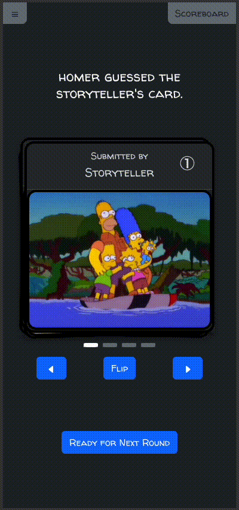

# Frinkxit
## A web app that lets users play _Dixit_ with screencaps from _The Simpsons_

Frinkxit is a multiplayer web app game with the rules of [_Dixit_](https://boardgamegeek.com/boardgame/39856/dixit) which uses images from [_The Simpsons_](https://www.disneyplus.com/series/the-simpsons/3ZoBZ52QHb4x) as cards.  
The Simpsons screencaps, episode info, and subtitles were sourced from [Frinkiac](https://frinkiac.com)'s API.

The game is currently deployed at [https://frinkxit.gregexp.com/](https://frinkxit.gregexp.com).

Players start a game by either creating a room or joining an existing room with a 4-letter code.
Once more than 3 players are in a room and every player has entered a name, the player who created the room can start the game by clicking the "Start Game" button. 

## Technical Details
The backend is composed of a Node application that communicates with the frontend using Express and Socket.IO, a Postgres database that holds info about the screencaps that serve as cards, an S3-compatible bucket for screencap storage, and a Redis instance that stores game state and temporarily caches card info upon retrieval from Postgres.

The frontend is a React app that makes use of Bootstrap and Framer Motion.   

Python Image Library (PIL) was used to flag images that were predominantly dark due to the unsuitability of _Simpsons_ credits screencaps for gameplay.

### JSON Patch
A prior version of this project sent the entire game state to the client every time an update occurred.
It was nice that this implicitly handled potential desync issues--if a client misses a single update from the server, it received the information baked into the next update--but it was more outgoing data than necessary. Even if only one small part of the game's state changed, the server would send out an entire Room object comprised of the entire game state.

This inefficient use of data was mitigated by modifying the application to only send clients the data they need to transform their game state from the previous game state into the current game state. This was accomplished by defining a Socket.IO event `receiveRoomPatch` that broadcasts game events from the server to the clients in [JSON Patch](https://jsonpatch.com/) format. This saves a large amount of outgoing data by only sending information about the relevant changes to the game state instead of the entire game state. To prevent desync issues, the schema for the Room object contains an integer `updateCount` which is incremented once per patch emitted from the server. Therefore, the client-side application can check that updates are received in order by checking that the `updateCount` of the received event is equal to present `updateCount + 1`.

In the event of disconnection or a missed `receiveRoomPatch` event, the entire game state _can_ be sent to the client. The choice of a RedisJSON document database to store game state server-side is perfect for this use case--the entire Room object is retrieved from Redis using its code as the key, and the entire object is sent to the requesting client. However, the standard way the server sends updates to the client is by only sending the relevant information in a JSON Patch object that performs the relevant mutations on the Room object. The same JSON Patch operation acts on the Room object stored in Redis as well. In the event of a client disconnect or missed update, the Room object stored in Redis acts as a single source of truth.

## Gameplay Clips

